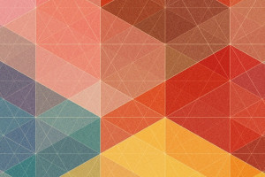

<a name="readme-top">

<br/>

<br />
<div align="center">
  <a href="https://github.com/zyx-0314/">
  <!-- TODO: If you want to add logo or banner you can add it here -->
    
  </a>
<!-- TODO: Change Title to the name of the title of your Project -->
  <h3 align="center">Feature Page</h3>
</div>
<!-- TODO: Make a short description -->
<div align="center">
   Feature pages showcasing different layouts and design.
</div>

<br />

<!-- TODO: Change the zyx-0314 into your github username  -->
<!-- TODO: Change the WD-Template-Project into the same name of your folder -->


---

<br />
<br />

<!-- TODO: If you want to add more layers for your readme -->
<details>
  <summary>Table of Contents</summary>
  <ol>
    <li>
      <a href="#overview">Overview</a>
      <ol>
        <li>
          <a href="#key-components">Key Components</a>
        </li>
        <li>
          <a href="#technology">Technology</a>
        </li>
      </ol>
    </li>
    <li>
      <a href="#rule,-practices-and-principles">Rules, Practices and Principles</a>
    </li>
    <li>
      <a href="#resources">Resources</a>
    </li>
  </ol>
</details>

---

## Overview

<!-- TODO: To be changed -->
<!-- The following are just sample -->

What is the project?
- A feature page showcasing different feature pages with a modern and responsive design.

What's the purpose?
- To display products attractively and encourage user engagement and purchases.

What are key components?
- Single-page website layout.
- Responsive design using CSS flexbox.
- Product carousel for displaying items.

What technology were used and how it is used?
- HTML: Structures the content.
- CSS: Styles the page and makes it responsive.
- Google Fonts: Enhances readability

### Key Components
<!-- TODO: List of Key Components -->
<!-- The following are just sample -->
- Multi-page website layout
- Responsive design with CSS flexbox
- Carousel for product display

### Technology
<!-- TODO: List of Technology Used -->


## Rules, Practices and Principles
1. Always use `WD-` in the front of the Title of the Project for the Subject followed by your custom naming.
2. Do not rename any .html files; always use `index.html` as the filename.
3. Place Files in their respective folders.
4. All file naming are in camel case.
   - Camel case is naming format where there is no white space in separation of each words, the first word is in all lower case while the succeding words first letter are in upper followed by lower cased letters.
   - ex.: buttonAnimatedStyle.css
5. Use only `External CSS`.
6. Renaming of Pages folder names are a must, and relates to what it is doing or data it holding.
7. File Structure to follow below.

```
WD-ProjectName
└─ assets
|   └─ css
|   |   └─ style.css
|   └─ img
|   |   └─ fileWith.jpeg/.jpg/.webp/.png
|   └─ js
|       └─ script.js
└─ pages
|  └─ pageName
|     └─ assets
|     |  └─ css
|     |  |  └─ style.css
|     |  └─ img
|     |  |  └─ fileWith.jpeg/.jpg/.webp/.png
|     |  └─ js
|     |     └─ script.js
|     └─ index.html
└─ index.html
└─ readme.md
```

## Resources

<!-- TODO: Add References -->
| Title | Purpose | Link |
|-|-|-|
| Product Page by ValentinSLN - Web UI Inspiration  | Source of UI inspiration for product pages | https://uigarage.net/product-page-by-valentinsln-web-ui-inspiration/ |
| Uiverse Elements | Collection of UI elements for web design | https://uiverse.io/elements |
| Dribbble - Feature Design Search | Platform to search for design features and inspiration	 | https://dribbble.com/search/feature-deaign |
| 100+ Underline/Overlay Animations - The Advanced CSS Collection | Guide to advanced CSS animations | https://dev.to/afif/still-100-underline-overlay-animations-the-advanced-css-collection-4mol |
| W3Schools CSS	 | Comprehensive resource for learning CSS | https://www.w3schools.com/css/default.asp
| | | |

